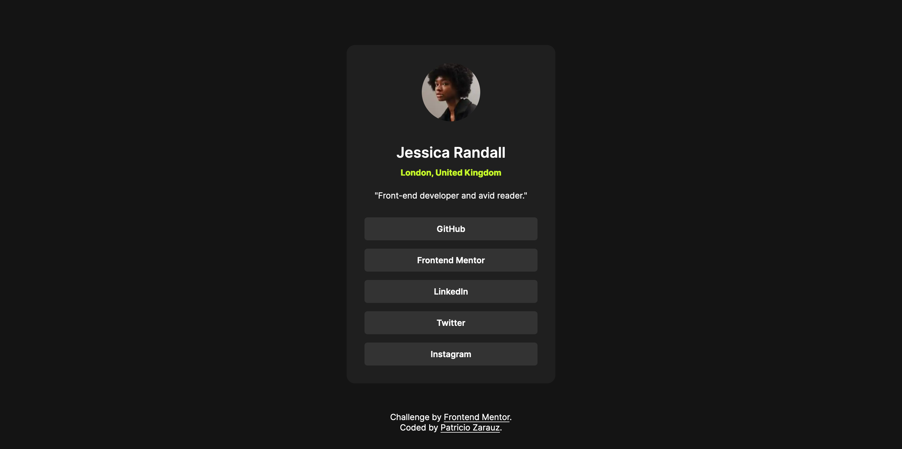
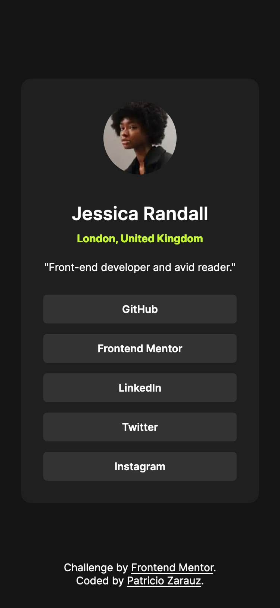

# Frontend Mentor - Social links profile solution

This is a solution to the [Social links profile challenge on Frontend Mentor](https://www.frontendmentor.io/challenges/social-links-profile-UG32l9m6dQ). Frontend Mentor challenges help you improve your coding skills by building realistic projects.

## Table of contents

- [Frontend Mentor - Social links profile solution](#frontend-mentor---social-links-profile-solution)
  - [Table of contents](#table-of-contents)
  - [Overview](#overview)
    - [The challenge](#the-challenge)
    - [Screenshot](#screenshot)
    - [Links](#links)
  - [My process](#my-process)
    - [Built with](#built-with)
    - [What I learned](#what-i-learned)
    - [Useful resources](#useful-resources)
  - [Author](#author)

## Overview

### The challenge

Users should be able to:

- See hover and focus states for all interactive elements on the page

### Screenshot

### Links

- Solution URL: [GitHub](https://github.com/PatricioZarauz/social-links-profile-main)
- Live Site URL: [Vercel](https://your-live-site-url.com)

## My process

### Built with

- Semantic HTML5 markup
- SASS
- Flexbox
- CSS Grid
- Mobile-first workflow
- Transition animation

### What I learned

Usage of box-sizing and correct implementation of transition animations

### Useful resources

- [Youtube Vid](https://www.youtube.com/watch?v=ceNMP-aQkQ4&list=PL4-IK0AVhVjNKdH-sQgq_z8gfqC6pRC9V&index=3) - This helped me with transition animations

## Author

- Frontend Mentor - [@PatricioZarauz](https://www.frontendmentor.io/profile/PatricioZarauz)
